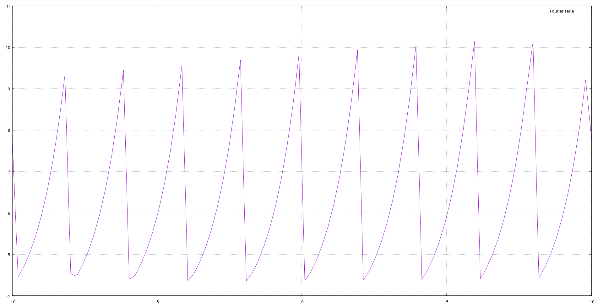

# Calculate Fourier Series

$$ f(x) = a_0 + \sum_{n=1}^{\infty}a_n \cos(\frac{n \pi x}{L})+b_n \sin(\frac{n \pi x}{L}) $$
$$ a_0 = \frac1T \int_{-L}^{L} f(x)\mathrm{d}x $$
$$ a_n = \frac1L \int_{-L}^{L} f(x)\cos(\frac{n \pi x}{L})\mathrm{d}x $$
$$ b_n = \frac1L \int_{-L}^{L} f(x)\sin(\frac{n \pi x}{L})\mathrm{d}x $$

The story started when my teacher in the mathematics engineering class assigned 
bonus points to someone who implemented the Fourier Series of f(x) with the 
help of a programming language. Immediately, a light bulb went off in my 
head. This is the best way to get high without weed. It seemed like a 
reasonable exercise. I accepted this undemanding task and then started 
writing code.

Eventually, I developed a UNIX-compliant application for calculating Fourier 
coefficients. This software is very flexible. You can change many parameters, 
such as precision, N, lower and upper limits, and so on. You can plot a 
series using the gnuplot back-end or simply obtain each coefficient per term.

## Why is this project written in C?
Honestly, developing software using C is like fighting with Vikings. It's hard 
but rewarding. I love C and the low-level world. When I get old, I want to 
die coding in C or assembly.

Anyway, developing this software using Python would have been more interesting 
and beneficial for visitors. My target audience is my classmates and our 
teacher. I want to show them what a real C project is and how it should be.

## What is the challenge?
Finding Fourier coefficients for a specific formula can be fun. But expanding 
the solution for f(x) is even more enjoyable. For this challenge, we need to 
convert a string to C code. Using a math expression parser like muParser is 
nice, but in this project, I solved this problem in a different way. Using 
shared libraries and generating them based on user input can be problematic. 
However, for a stand-alone application with educational purposes, nothing is 
too important. I reviewed my memories of this project.

## Documentation
Writing a complete guide and explanation about this code for students will 
be time-consuming. Feel free to use our English presentation built using 
Beamer and LaTeX.

# How to build and run

Run following script to clone and compile project.

```bash
git clone https://github.com/alirezaarzehgar/fouriersolver
cd fouriersolver
make
# sudo make install
```

Then you can run `./fouriersolver` binary and use its options.
You should pass 3 strings contain mathematical expressions with C syntax.
This strings actually converted to C code and compile to shared library.
After that software will call needed functions. You can control many things with
options. Use `-f` for printing formula, `-g` plot serie and `-h` for getting help.
See some examples:

```bash
$ fouriersolver "x/5" -n 5 -a "-M_PI" -b "M_PI"
B1 = 0.400000
B2 = -0.200000
B3 = 0.133300
B4 = -0.100000
$ fouriersolver "pow(x, 2)" -n 5 -a "-M_PI" -b "M_PI"
A0 = 6.582300
A1 = -4.002600
A2 = 1.002600
A3 = -0.447000
A4 = 0.252600
$ fouriersolver "pow(x, 2)" -n 5 -a "-M_PI" -b "M_PI" -f
+6.582300*cos(x*0*pi/pi)+-4.002600*cos(x*1*pi/pi)+1.002600*cos(x*2*pi/pi)+-0.447000*cos(x*3*pi/pi)+0.252600*cos(x*4*pi/pi)
$ fouriersolver "pow(M_E, x)" -a 0 -b "5" -g -d

  180 +--------------------------------------------------------------------+   
      |                +                 +                +                |   
  160 |-+..............:.................:...........Fouri*r serie.*******-|   
      |                *                *:                *                |   
      |                *                *:               **               *|   
  140 |-+.............**...............**:...............**..............+*|   
      |               **               **:               **               *|   
  120 |-+.............**...............**:..............*.*..............+*|   
      |              * *               **:              * *               *|   
      |              * *               **:             *  *              * |   
  100 |-+............*.*..............*.*:.............*..*..............*-|   
      |              * *             *   *             *  *             *  |   
   80 |-+...........*..*.............*...*............*...*.............*+-|   
      |            *   *             *   *            *   *            *   |   
      |*           *   *            *    *           *    *           *    |   
   60 |*+.........*....*...........*.....*..........**....*..........*...+-|   
      |*        **     *          **     *         *      *         **     |   
   40 |*+.....***......*........**.......*.......**.......*.......**.....+-|   
      |* ******        ** ******         ** ******        * ******         |   
      |**              + **              +**              +**              |   
   20 +--------------------------------------------------------------------+   
     -10              -5                 0                5                10  
```

Plot $f(x) = e^x$ in 0 < x < 2:
```bash
$ fouriersolver "pow(M_E, x)" -a 0 -b 2  -g
```


# Getting help

```bash
$ ./fouriersolver -h
./fouriersolver: F(x) [OPTION]... [-a] [-b]
-h       Getting help
-a       Lower integral limit
-b       Upper integral limit
-v       Show more details
-p       Change precision of result
-n       Specify N in discret sum
-g       Generate gnuplot syntax output
-d       Show output in terminal (dump terminal)
-f       Just print formula and gnuplot syntax
```

Use manpage `fouriersolver` to getting help.

# Contribution
This project is full of unimplemented features and unknown problems! You can 
fork it, make changes, and send your patches to me. It is completely for 
educational purposes. Feel free to send PRs. We can keep all changes in this 
repository, at least on other branches.

I hope you enjoy ❤‍
